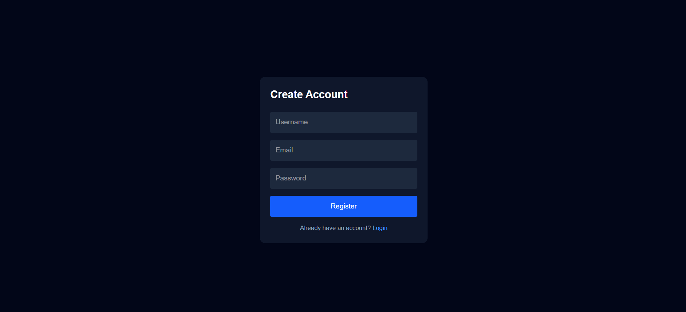
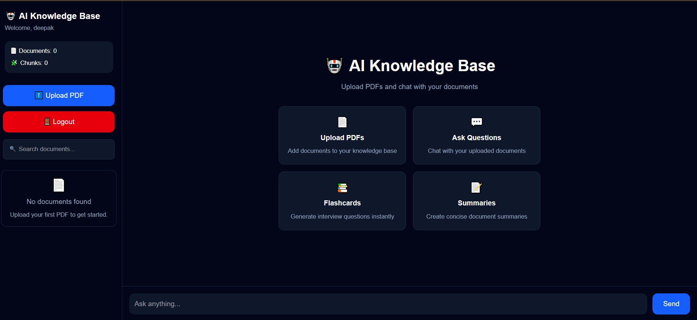
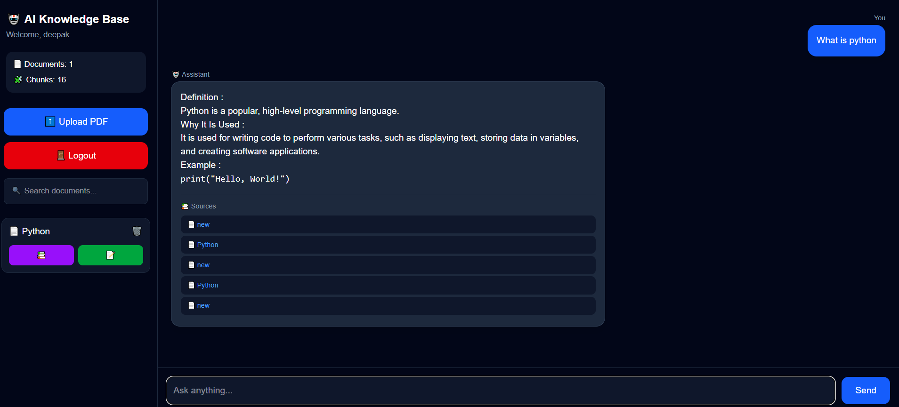
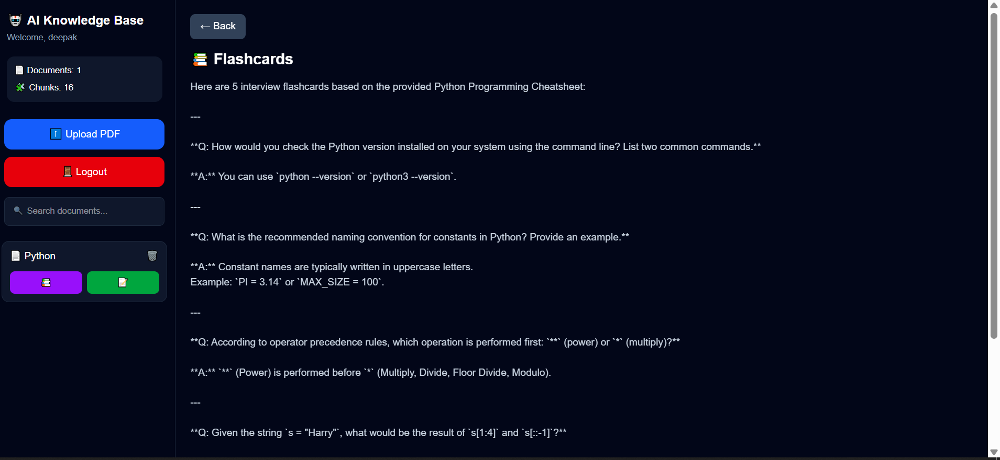
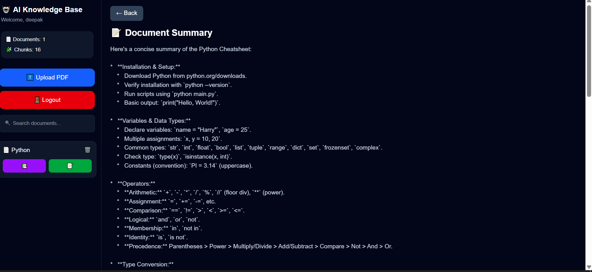

# 🤖 AI Knowledge Base

An AI-powered document assistant that allows users to upload PDFs, ask questions, generate summaries, and create flashcards using AI.

## 🚀 Features

* User Authentication (Register/Login/Logout)
* JWT Authentication with Django REST Framework
* Upload and Manage PDF Documents
* AI-Powered Question Answering
* Document Summarization
* Flashcard Generation
* Search Documents
* User-Specific Document Access
* Responsive Dashboard UI

## 🛠️ Tech Stack

### Frontend

* React
* Vite
* Tailwind CSS
* Axios
* React Router

### Backend

* Django
* Django REST Framework
* JWT Authentication

### Database

* SQLite (Development)
* PostgreSQL (Production Ready)

### AI Integration

* Google Gemini API

## 📸 Screenshots

### Login Page


### Register Page



### Dashboard



### AI Chat



### Flashcards



### Summary



## ⚙️ Installation

### Clone Repository

```bash
git clone https://github.com/DeepakAd12/Ai-Knowledge-Base.git
cd Ai-Knowledge-Base
```

### Backend Setup

```bash
cd backend

python -m venv venv

venv\Scripts\activate

pip install -r requirements.txt

python manage.py migrate

python manage.py runserver
```

### Frontend Setup

```bash
cd frontend

npm install

npm run dev
```

## 🔑 Environment Variables

Create a `.env` file inside the backend directory:

```env
GEMINI_API_KEY=your_api_key_here
```

## 🎯 Future Improvements

* Chat History Persistence
* Multi-Document Search
* Export Summary as PDF
* Advanced Retrieval (RAG)
* Document Tagging and Categories

## 👨‍💻 Author

Deepak Adhikari

GitHub: https://github.com/DeepakAd12
